# NEXUS‑LUNAR — Project Documentation

> **Branch:** `nexus-unified` · **HEAD:** `ebc2ed8` · **Audit Date:** 2026‑09‑10

---

## Implementation Status Legend

| Symbol | Meaning |
|---|---|
| 🟢 **IMPLEMENTED** | Verified in repository — module exists and contains functional code |
| 🟡 **PROTOTYPE / POC** | Present as experimental or proof‑of‑concept implementation |
| 🔵 **PROPOSED / FUTURE** | Not currently implemented — future enhancement idea |

> This legend is used consistently throughout this document. If a section or component does not carry a status label, refer to the nearest labelling context.

---

## Abstract

NEXUS‑LUNAR is an AI‑assisted lunar image registration, spatial intelligence, and habitat‑planning research platform developed for the **Smart India Hackathon (SIH)**. It integrates imagery from **NASA LRO NAC** and **ISRO Chandrayaan‑2 (OHRC / TMC2)** and provides prototype capabilities for cross‑sensor image correspondence, geometric verification, terrain and illumination analysis, knowledge‑graph‑based spatial reasoning, first‑principles scientific modelling, habitat‑constraint analysis, and 3D visualization.

The platform is a **research prototype** and **decision‑support tool** — not a production‑grade or mission‑ready system.

---

## ⏱️ NEXUS‑LUNAR in 2 Minutes (Judge Page)

| Step | What | How |
|---|---|---|
| **1 — Collect** | LRO NAC + Chandrayaan‑2 OHRC / TMC2 imagery | PDS ODE & ISSDC data clients, catalog ingestion |
| **2 — Align** | Cross‑sensor image registration | Classical feature matching (SIFT, ORB, AKAZE, RootSIFT) **and** AI multimodal embeddings — run as parallel approaches |
| **3 — Verify** | Geometric verification + explainable confidence | RANSAC, homography/affine estimation, inlier analysis, XAI scoring |
| **4 — Analyze** | Terrain, illumination, resources, hazards | Spatial intelligence engines + knowledge graph |
| **5 — Decide** | Candidate‑site intelligence & scoring | Composite site‑suitability scoring engine |
| **6 — Visualize** | Habitat planning prototype + web dashboard | Habitat constraint planner, Three.js 3D viewer, Leaflet GIS map |

*Each step maps directly to implemented repository modules described below.*

---

## 🚩 Problem → Solution

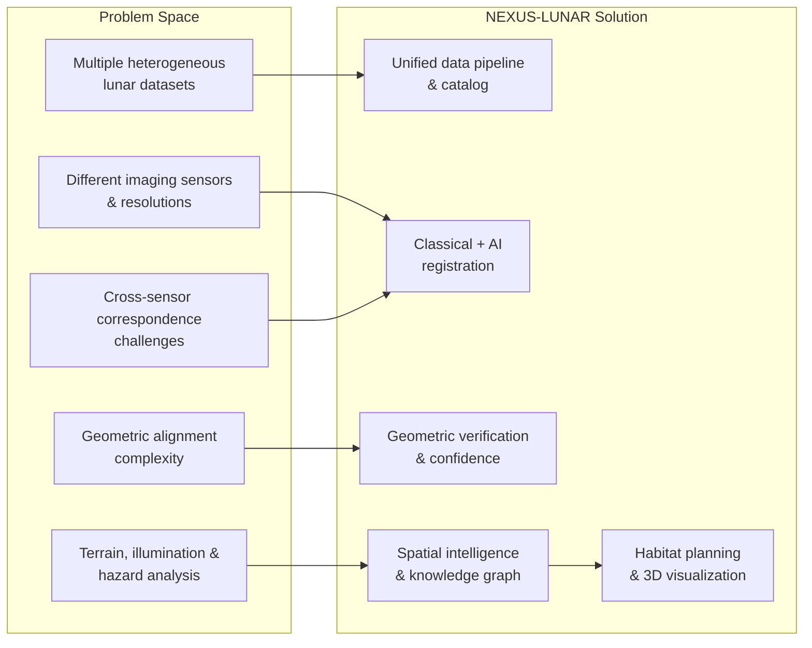

---

## 🏗️ Full System Architecture (Layered)

> **Key correction:** Classical Registration and AI Correspondence are **parallel branches**, not sequential. Both feed into Geometric Verification.

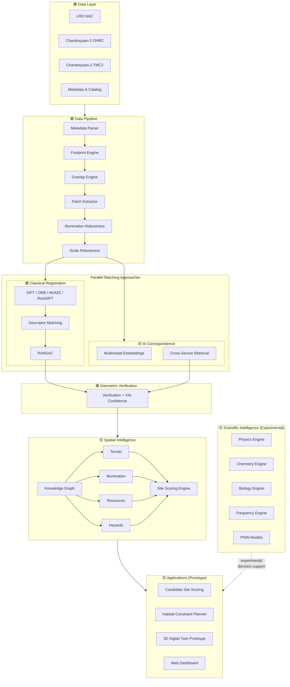

> **Note:** Scientific Intelligence modules are available in the repository but their integration into the final site‑scoring pipeline is experimental. The dashed arrow indicates a supporting/optional relationship.

---

## 🔁 End‑to‑End Workflow

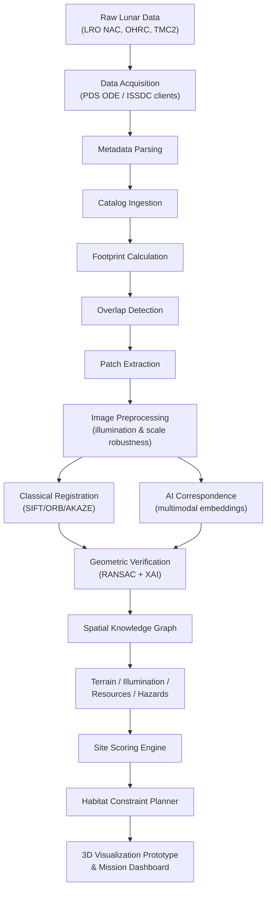

> Classical Registration and AI Correspondence run as **parallel approaches** — both feed into Geometric Verification.

---

## 🖼️ Image Registration — How It Works

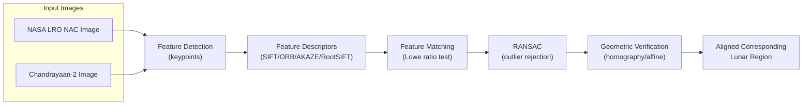

*This makes registration understandable: two images from different sensors are aligned by finding common features, rejecting bad matches, and computing a geometric transform.*

---

## ⚔️ Classical vs AI — Comparison

| Aspect | Classical Registration 🟢 | AI Correspondence 🟡 |
|---|---|---|
| **Package** | `packages/registration/` | `packages/data_pipeline/poc5_*` |
| **Methods** | SIFT, ORB, AKAZE, RootSIFT | Multimodal patch embeddings |
| **Matching** | Descriptor matching + Lowe ratio test | Cross‑sensor embedding retrieval |
| **Verification** | RANSAC + homography/affine | Candidate matching + confidence |
| **Status** | Implemented (6 modules) | Prototype / POC |

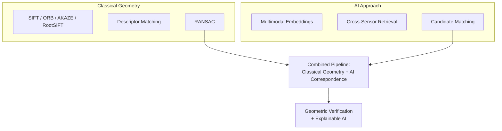

> The repository implements both approaches. Neither is claimed as superior — they are complementary paths feeding into the same verification stage.

---

## 📆 POC Roadmap

> **Important:** POC numbering is **module‑family specific** within the repository. `nexus_core` and `data_pipeline` contain **overlapping POC identifiers** (POC 4–7 exist in both packages with different meanings). This is a known repository finding documented below.

### Two POC Families

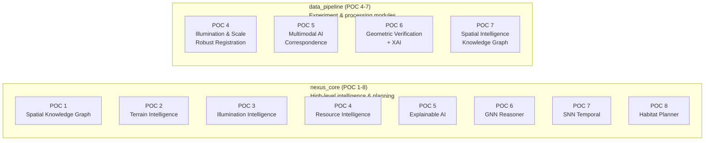

### Combined Logical Progression

| Stage | POC | Package | Module | Status |
|---|---|---|---|---|
| **Data → Understanding** | POC 1 | `nexus_core` | `poc1_knowledge_graph.py` | 🟡 Prototype |
| | POC 2 | `nexus_core` | `poc2_terrain_intelligence.py` | 🟡 Prototype |
| | POC 3 | `nexus_core` | `poc3_illumination_intelligence.py` | 🟡 Prototype |
| **Intelligence** | POC 4 | `data_pipeline` | `poc4_matching.py`, `poc4_experiment.py`, etc. | 🟢 Implemented |
| | POC 4 | `nexus_core` | `poc4_resource_intelligence.py` | 🟡 Prototype |
| | POC 5 | `data_pipeline` | `poc5_models.py`, `poc5_retrieval.py`, etc. | 🟡 Prototype |
| | POC 5 | `nexus_core` | `poc5_explainable_ai.py` | 🟡 Prototype |
| **Decision** | POC 6 | `data_pipeline` | `poc6_verification.py`, `poc6_experiment.py`, etc. | 🟢 Implemented |
| | POC 6 | `nexus_core` | `poc6_gnn_reasoner.py` | 🟡 Prototype |
| | POC 7 | `data_pipeline` | `poc7_knowledge_graph.py`, `poc7_terrain.py`, etc. | 🟡 Prototype |
| | POC 7 | `nexus_core` | `poc7_snn_temporal.py` | 🟡 Prototype |
| **Habitat** | POC 8 | `nexus_core` | `poc8_habitat_planner.py` | 🟡 Prototype |

> ⚠️ **POC numbering collision:** `nexus_core/poc4_resource_intelligence.py` and `data_pipeline/poc4_*` both use the label "POC 4" but implement entirely different features. The same overlap applies to POC 5, 6, and 7.

---

## 🌐 Spatial Intelligence

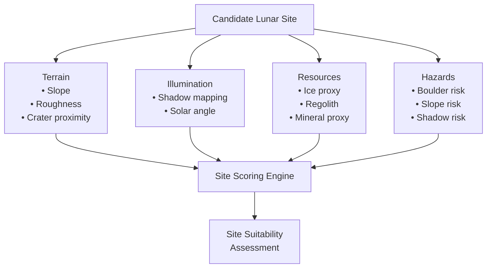

*Module: `packages/data_pipeline/poc7_site_intelligence.py` — 🟡 Prototype*

---

## 🕸️ Knowledge Graph

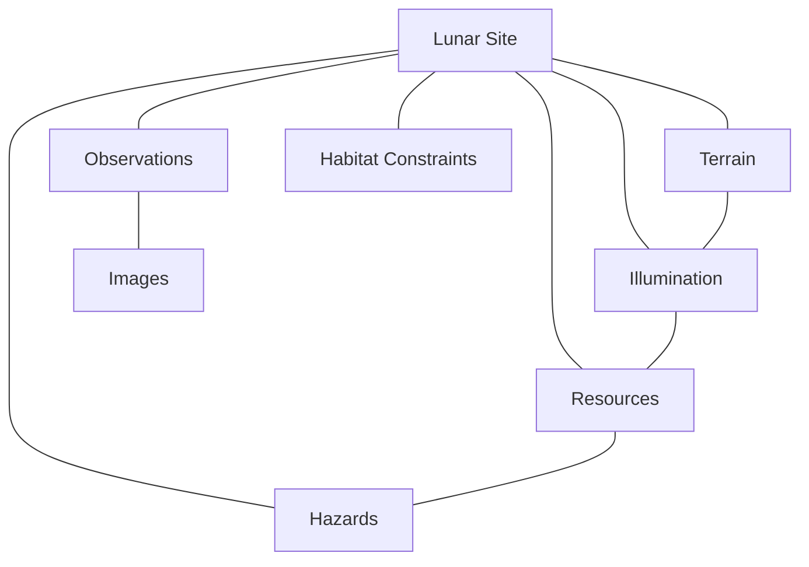

*Modules: `data_pipeline/poc7_knowledge_graph.py` (🟡 Prototype) and `nexus_core/poc1_knowledge_graph.py` (🟡 Prototype)*

> Two knowledge‑graph implementations exist — one in each package. This is a known duplication.

---

## 🔬 First‑Principles Scientific Modules

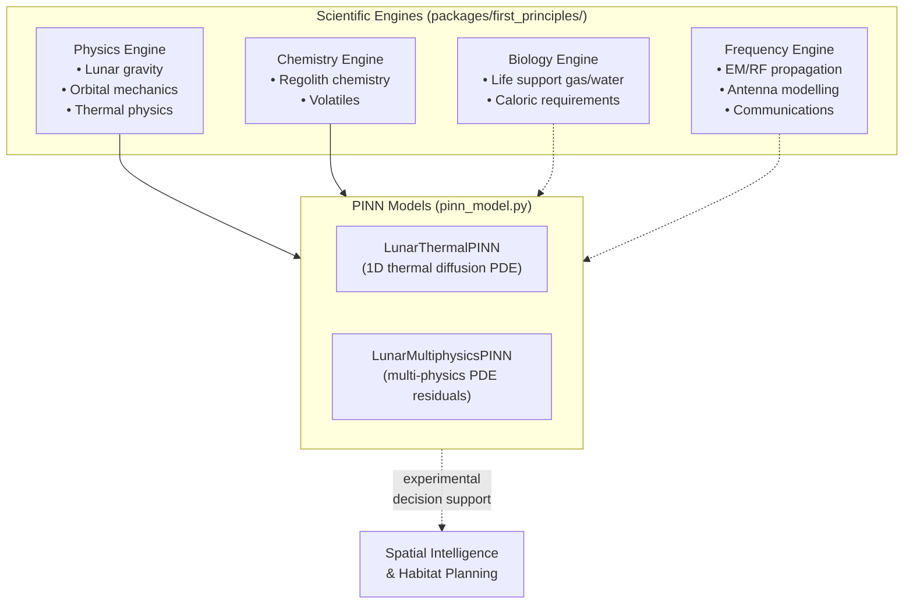

**Status:** 🟡 Prototype — All modules exist and contain functional code. PINN models use PyTorch autograd for PDE residual solving. Integration into the main site‑scoring pipeline is experimental.

> The PINN models do **not** require GPU/CUDA — no CUDA references exist anywhere in the repository. They run on CPU via standard PyTorch.

---

## 🏠 Habitat Planning & 3D Visualization Prototype

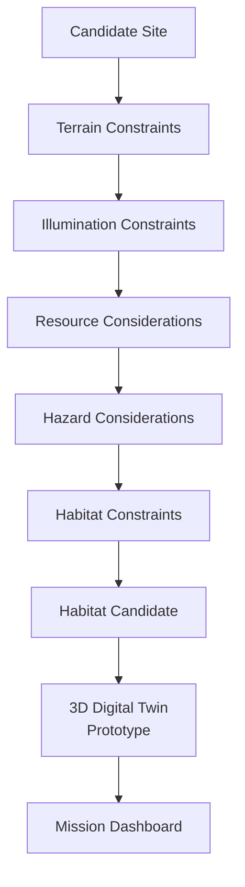

**Status:** 🟡 Prototype — `nexus_core/poc8_habitat_planner.py` implements habitat constraint planning. The 3D digital twin and Blender integration (`blender_mcp_client.py`) are experimental prototypes.

---

## 💻 Frontend / Mission Dashboard

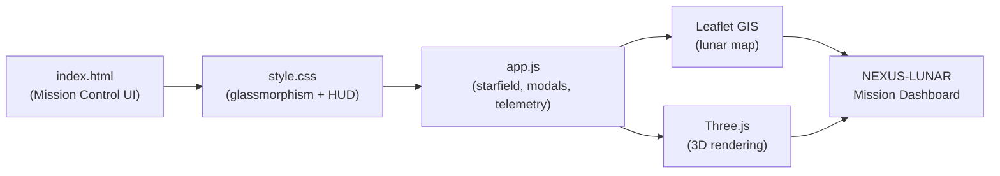

**Status:** 🟢 Implemented — 4 files in `web/` directory.

**Dashboard conceptual areas** (based on actual `app.js` and `index.html`):
- Lunar Map (Leaflet GIS)
- Imagery viewer
- Analysis panels
- Telemetry display
- 3D Visualization (Three.js)

---

## ⚙️ Backend / Microservices

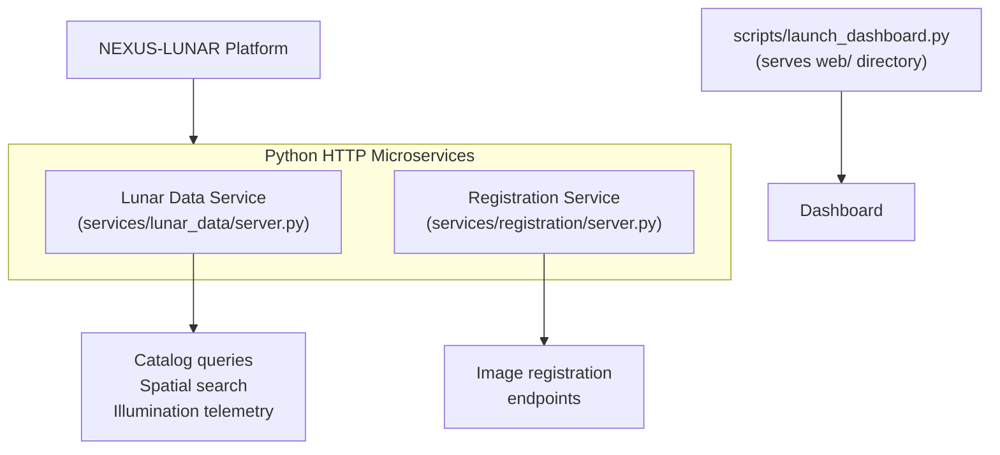

**Implementation:** Both services use Python's built‑in `http.server.HTTPServer` with `SimpleHTTPRequestHandler` — **not** FastAPI or any third‑party web framework.

**Status:** 🟢 Implemented

> ⚠️ **Known issue:** `services/lunar_data/server.py` references `WEB_DIR = apps/web/` which does **not exist**. The actual frontend is at `web/`. This causes frontend serving to fail for this service. `scripts/launch_dashboard.py` correctly uses `web/`.

---

## 📂 Repository Visual Map

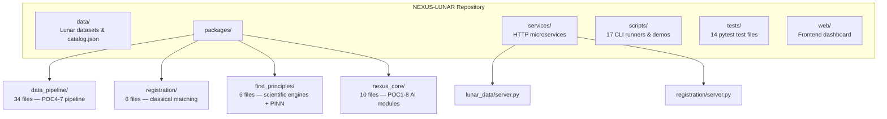

---

## 🧪 Testing

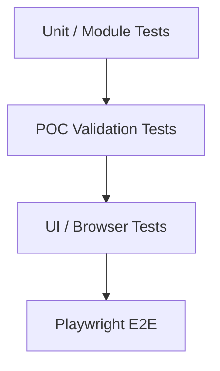

**14 pytest test files** covering:

| Test File | Area |
|---|---|
| `test_classical_registration.py` | Classical registration package |
| `test_first_principles.py` | First‑principles engines |
| `test_nexus_poc6_gnn.py` | nexus_core GNN reasoner |
| `test_nexus_poc7_snn.py` | nexus_core SNN temporal |
| `test_nexus_poc8_habitat.py` | nexus_core habitat planner |
| `test_overlap_engine.py` | Overlap detection |
| `test_patch_extractor.py` | Patch extraction |
| `test_poc2_advanced_validation.py` | POC2 validation |
| `test_poc4_illumination_scale.py` | POC4 robustness |
| `test_poc5_multimodal.py` | POC5 AI correspondence |
| `test_poc6_verification.py` | POC6 geometric verification |
| `test_poc6_ui_playwright.py` | POC6 UI browser tests |
| `test_poc7_spatial_intelligence.py` | POC7 spatial intelligence |
| `test_playwright_e2e.py` | End‑to‑end browser automation |

> ⚠️ **Known issue:** No shared `tests/conftest.py` exists — tests may require manual `sys.path` configuration.

---

## 📊 Current Repository Status

| Item | Value |
|---|---|
| **Branch** | `nexus-unified` |
| **HEAD** | `ebc2ed8e29cc166042596894aacf919d67d88e06` |
| **Working Tree** | Clean |
| **Tracked Files** | 134 |
| **Python (.py)** | 89 |
| **PNG Images** | 19 |
| **GeoTIFF (committed)** | 6 |
| **Markdown (.md)** | 10 |
| **JavaScript (.js)** | 2 |
| **JSON (.json)** | 2 |
| **CSS (.css)** | 1 |
| **HTML (.html)** | 1 |
| **Text (.txt)** | 1 |
| **XML (.xml)** | 1 |
| **Other (LICENSE, .gitignore)** | 2 |

---

## 🛠️ Technology Stack

### Declared Dependencies (`requirements.txt`)

| Package | Version Constraint |
|---|---|
| requests | ≥ 2.28.0 |
| pydantic | ≥ 2.0.0 |
| tqdm | ≥ 4.65.0 |
| xmltodict | ≥ 0.13.0 |
| shapely | ≥ 2.0.0 |
| numpy | ≥ 1.22.0 |
| Pillow | ≥ 9.0.0 |

### Repository‑Used / Implicit Dependencies (not in `requirements.txt`)

| Package | Used By |
|---|---|
| OpenCV (`cv2`) | `services/registration/server.py`, registration modules |
| PyTorch (`torch`) | `packages/first_principles/pinn_model.py` |
| Playwright | `tests/test_playwright_e2e.py`, `test_poc6_ui_playwright.py` |
| Matplotlib | All POC4–POC7 visualization modules |
| SciPy | Registration and POC4 modules |
| NetworkX | Knowledge graph modules |

> ⚠️ **Known issue:** `requirements.txt` does not list all imported dependencies. A fresh install from `requirements.txt` alone will fail at runtime for modules requiring OpenCV, PyTorch, Matplotlib, SciPy, or NetworkX.

### Runtime Environment

| Item | Value |
|---|---|
| **Language** | Python (configured interpreter: Python 3.14) |
| **Frontend** | JavaScript (ES6), HTML, CSS |
| **HTTP Server** | Python `http.server` (stdlib) |
| **GIS** | Leaflet.js |
| **3D** | Three.js (bundled `three.min.js`) |
| **Data Formats** | GeoTIFF, PNG, JSON, XML |

> The Python 3.14 interpreter path is configured in `.vscode/settings.json`. No `pyproject.toml` or `setup.py` exists for installable packaging.

---

## ⚠️ Current Repository Findings

### 🔴 Critical

| Issue | Detail |
|---|---|
| **Frontend serving path mismatch** | `services/lunar_data/server.py` (line 21) sets `WEB_DIR = apps/web/` — the `apps/` directory does **not** exist. Actual frontend is at `web/`. Frontend requests 404 via this service. |

### 🟠 Warnings

| Issue | Detail |
|---|---|
| **Incomplete `requirements.txt`** | Missing: `opencv-python`, `torch`, `playwright`, `matplotlib`, `scipy`, `networkx`. Fresh install fails. |
| **No `pyproject.toml` / `setup.py`** | Packages cannot be pip‑installed. Requires manual `sys.path` hacks. |
| **POC numbering collision** | `nexus_core` and `data_pipeline` both use POC 4–7 labels for different features. |
| **Duplicate TerrainIntelligenceEngine** | Implemented in both `nexus_core/poc2_terrain_intelligence.py` and `data_pipeline/poc7_terrain.py`. |
| **Committed TIFF files** | 6 `.tif` files committed despite `*.tif` in `.gitignore` (committed before the rule was added). |
| **Duplicate blueprint docs** | `NEXUS_LUNAR_SIH_Complete_Blueprint.md` (44 KB) and `NEXUS-LUNAR_SIH_Complete_Project_Blueprint.md` (41 KB) — likely one supersedes the other. |
| **No `tests/conftest.py`** | No shared pytest path/fixture setup. |

### 🟡 Minor

| Issue | Detail |
|---|---|
| **Missing script runners** | No `run_poc3_experiment.py` or `run_poc8_experiment.py` (inconsistent with POC4–POC7 pattern). |
| **Favicon control character** | `web/index.html` line 13: favicon SVG contains a raw `\x07` (bell) control character. |
| **Orphaned script** | `scripts/render_blender_scene.py` — no callers found anywhere in the codebase. |
| **TIFF discrepancy** | `nac.m1419447916re` has only a preview PNG — no `_browse.tif` committed (exists on disk untracked). |
| **Possibly unused module** | `packages/data_pipeline/visualization.py` — not exported in `__init__.py`. |

> These findings are presented for transparency and improvement tracking — they do not negate the project's research contributions.

---

## ↔️ Before vs After

```mermaid
flowchart LR
    subgraph BEFORE["Without NEXUS-LUNAR"]
        B1["Separate heterogeneous\nlunar datasets"]
        B2["Sensor-specific\nanalysis workflows"]
        B3["No unified cross-sensor\ncorrespondence"]
        B4["Limited integrated\nspatial reasoning"]
    end

    subgraph AFTER["With NEXUS-LUNAR"]
        A1["Unified multi-sensor\ndata pipeline"]
        A2["Classical + AI\nregistration"]
        A3["Geometric verification\n+ XAI confidence"]
        A4["Spatial intelligence\n& knowledge graph"]
        A5["Scientific modelling\n(experimental)"]
        A6["Site scoring &\nhabitat planning"]
        A7["3D visualization\nprototype & dashboard"]
    end

    BEFORE -->|"NEXUS-LUNAR\nintegrates"| AFTER
```

---

## 📋 Detailed Text Sections

### Problem Statement

Lunar exploration missions generate imagery from multiple heterogeneous sensors (LRO NAC at ~0.5 m/px, Chandrayaan‑2 OHRC at ~0.3 m/px, TMC2 at ~5 m/px) with different spectral characteristics, resolutions, and illumination conditions. Establishing reliable cross‑sensor correspondences and performing integrated terrain, illumination, resource, and hazard analysis across these datasets presents significant technical challenges in geometric alignment, feature matching under varying conditions, and unified spatial reasoning.

### Objectives

- Unify multi‑sensor lunar imagery into a common catalog and processing pipeline.
- Provide cross‑sensor image registration using both classical computer‑vision and AI‑based approaches.
- Implement geometric verification with explainable confidence scoring.
- Build spatial intelligence through knowledge‑graph‑based terrain, illumination, resource, and hazard analysis.
- Prototype habitat‑constraint planning and 3D visualization for candidate site assessment.
- Provide an interactive web dashboard for exploring analysis results.

### Architecture

*(See the Layered Architecture diagram above — classical registration and AI correspondence are parallel branches feeding into geometric verification.)*

### Data Pipeline

Modules reside in `packages/data_pipeline/` (34 files). The pipeline covers: metadata parsing, footprint computation, overlap detection, patch extraction, illumination robustness preprocessing, and scale robustness.

### AI Components 🟡

- Multimodal patch embedding models (`poc5_models.py`)
- Cross‑modal retrieval engine (`poc5_retrieval.py`)
- Explainable geometric verification (`poc6_verification.py`)
- Graph neural‑network spatial reasoner (`nexus_core/poc6_gnn_reasoner.py`)
- Spiking neural‑network temporal reasoner (`nexus_core/poc7_snn_temporal.py`)
- Explainable AI site selection (`nexus_core/poc5_explainable_ai.py`)

### First‑Principles Components 🟡

Physics, Chemistry, Biology, and Frequency engines plus PINN models reside in `packages/first_principles/` (6 files). These modules provide scientific modelling capabilities. Their integration into the final site‑scoring pipeline is experimental.

### Backend 🟢

Two Python HTTP microservices in `services/` expose catalog/spatial‑search and image‑registration APIs. Both use Python's built‑in `http.server` module.

### Frontend 🟢

Web dashboard in `web/` (4 files) built with HTML, CSS, JavaScript, Leaflet GIS, and Three.js.

### Cleanup Recommendations

- Consolidate or clearly namespace POC numbering across packages.
- Fix `WEB_DIR` in `services/lunar_data/server.py` to point to `web/`.
- Expand `requirements.txt` to include all imported dependencies.
- Add `pyproject.toml` for proper package installation.
- Add `tests/conftest.py` for shared pytest configuration.
- Remove committed `.tif` binaries or use Git LFS.
- Resolve duplicate blueprint documentation.
- Add missing script runners for POC 3 and POC 8.

### Limitations

- No `pyproject.toml` — installation requires manual path configuration.
- `requirements.txt` is incomplete — not all runtime dependencies are declared.
- PyTorch‑based AI modules are included; hardware acceleration requirements depend on the specific experiment (no CUDA/GPU requirement is enforced in the code).
- POC 8 (habitat planner) and 3D digital twin are experimental prototypes.
- Scientific intelligence modules are available but not fully integrated into the main pipeline.

### 🔵 Proposed Future Directions

These ideas are **not currently implemented** — they represent potential enhancements:

- Cloud deployment of microservices for scalability
- Integration of additional lunar data sources
- Expanded scientific engines (e.g., radiation modelling)
- Reinforcement‑learning for autonomous site‑selection optimization
- Enhanced 3D digital twin with real‑time data feeds

### Conclusion

NEXUS‑LUNAR provides an integrated research prototype that bridges the gap between heterogeneous lunar datasets and unified spatial analysis. Through a combination of classical computer‑vision registration, AI‑assisted correspondence, geometric verification, spatial intelligence, and scientific modelling, it delivers a prototype decision‑support platform for lunar habitat site assessment — visualized through an interactive web dashboard and 3D visualization prototype.

---

*Prepared for the Smart India Hackathon · Branch `nexus-unified` · Verified against repository audit dated 2026‑09‑10*
